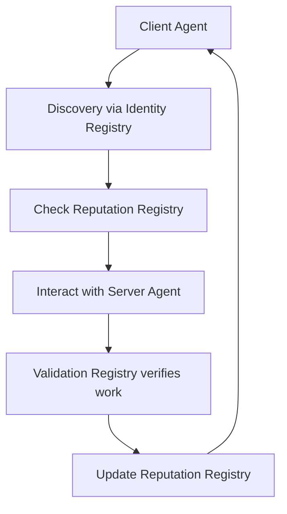

# Introduction to ERC-8004: Trustless Agents

## 🤔 What is ERC-8004?

**ERC-8004** is an Ethereum standard that enables AI agents to discover, trust, and interact across organizational boundaries **without pre-existing relationships**.

Think of it as the "LinkedIn for AI agents" - but with cryptographic trust instead of social connections.

## 🌟 The Problem

Current AI agents work in silos:
- **Discovery**: How does Agent A find Agent B?
- **Trust**: How can Agent A trust Agent B's work?
- **Verification**: How to prove Agent B delivered what was promised?

## ✨ The Solution: Three Registries

### 1. 🆔 **Identity Registry** (ERC-721)
- **What**: Portable agent identifiers
- **How**: NFT tokens pointing to agent metadata
- **Example**: `agentId: 42 → "AI trading bot specializing in DeFi"`

### 2. 🌟 **Reputation Registry**
- **What**: Structured feedback system
- **How**: Signed authorizations + on-chain scores
- **Example**: `Alice rates Bob: 85/100 for "market analysis"`

### 3. ✅ **Validation Registry**  
- **What**: Independent verification
- **How**: Third-party validators check agent work
- **Example**: `Validator confirms Bob's analysis was accurate`

## 🎯 Real-World Use Cases

### **DeFi Trading Agents**
```
Agent A: "I need market analysis for ETH/USDC"
Registry: "Agent B specializes in this (95% reputation)"
Agent B: Delivers analysis
Validator: Confirms accuracy
Agent A: Pays + leaves feedback
```

### **Code Review Services**
```
Developer: "Need security audit for my smart contract"  
Registry: "Agent C is a security specialist (98% reputation)"
Agent C: Performs audit
TEE: Cryptographically proves audit was thorough
Developer: Pays + updates Agent C's reputation
```

## 🔄 The Trust Flow



## 💡 Key Innovations

1. **No Platform Lock-in**: Agents own their identity (NFT)
2. **Composable Trust**: Mix reputation + cryptographic proofs
3. **Cross-Chain Ready**: Works on any EVM-compatible blockchain
4. **Gas Efficient**: Heavy data stays off-chain, integrity on-chain

## 🚀 What We'll Build Today

By the end of this workshop, you'll have:
- ✅ Deployed the three ERC-8004 registries
- ✅ Created your first trustless agent
- ✅ Built a multi-agent workflow
- ✅ Integrated reputation and validation

**Ready to dive in?** 🏊‍♂️

---

**Next**: [Live Demo →](./02-live-demo.md)