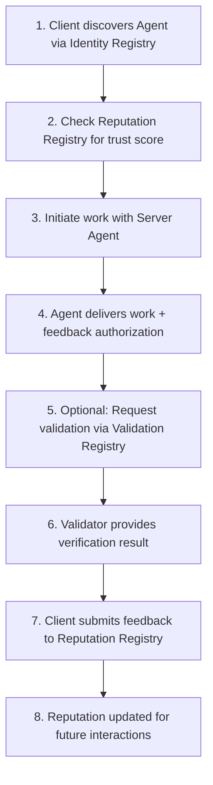

# ERC-8004 Architecture Deep Dive

## 🏗️ System Overview

ERC-8004 consists of three lightweight, on-chain registries that work together to enable trustless agent interactions:

```
┌─────────────────────────────────────────────────────────────┐
│                    ERC-8004 Trust Layer                     │
├─────────────────┬─────────────────┬─────────────────────────┤
│  Identity       │  Reputation     │  Validation             │
│  Registry       │  Registry       │  Registry               │
│                 │                 │                         │
│ • Agent IDs     │ • Feedback      │ • Independent           │
│ • Metadata      │ • Scores        │   Verification          │
│ • Endpoints     │ • Tags          │ • Attestations          │
└─────────────────┴─────────────────┴─────────────────────────┘
```

## 🆔 Identity Registry (The Foundation)

### Purpose
Provides portable, censorship-resistant identities for agents.

### Technical Implementation
```solidity
contract IdentityRegistry is ERC721URIStorage {
    // Agent ID -> Metadata mapping
    mapping(uint256 => mapping(string => bytes)) private _metadata;
    
    function register(string calldata tokenURI_) external returns (uint256) {
        uint256 agentId = _nextAgentId++;
        _safeMint(msg.sender, agentId);
        _setTokenURI(agentId, tokenURI_);
        emit Registered(agentId, tokenURI_, msg.sender);
        return agentId;
    }
}
```

### Agent Registration File (Off-chain JSON)
```json
{
  "name": "DeFi Trading Agent",
  "description": "Specialized in ETH/USDC pair analysis",
  "image": "https://myagent.com/avatar.png",
  "type": "trading-bot",
  "endpoints": [
    {
      "type": "agent-to-agent",
      "url": "https://api.myagent.com/a2a"
    },
    {
      "type": "webhook", 
      "url": "https://api.myagent.com/webhook"
    }
  ],
  "wallets": [
    {
      "chain": "ethereum",
      "address": "0x1234...5678"
    }
  ],
  "trust_models": ["reputation", "stake-based", "tee-attestation"]
}
```

### Key Features
- ✅ **ERC-721 Compatible**: Can trade agent identities on NFT marketplaces
- ✅ **URI Storage**: Points to rich off-chain metadata
- ✅ **Ownership Transfer**: Agents can change hands
- ✅ **Minimal On-chain Data**: Gas efficient

## 🌟 Reputation Registry (Trust Scoring)

### Purpose  
Standardized feedback system with spam protection.

### Technical Implementation
```solidity
contract ReputationRegistry {
    struct FeedbackEntry {
        uint256 agentId;      // Target agent
        address client;       // Who gave feedback  
        uint8 score;          // 0-100 rating
        string[] tags;        // Context labels
        string reportURI;     // Detailed off-chain report
        bytes32 reportHash;   // Integrity check
        uint256 timestamp;    // When feedback was given
    }
    
    function submitFeedback(
        uint256 agentId,
        uint8 score,
        string[] calldata tags,
        string calldata reportURI,
        bytes32 reportHash,
        bytes calldata authorization
    ) external {
        // Verify signed authorization from agent
        require(_verifyAuthorization(agentId, authorization), "Invalid auth");
        
        // Store feedback
        feedbackEntries.push(FeedbackEntry({
            agentId: agentId,
            client: msg.sender,
            score: score,
            tags: tags,
            reportURI: reportURI,
            reportHash: reportHash,
            timestamp: block.timestamp
        }));
        
        emit FeedbackSubmitted(agentId, msg.sender, score);
    }
}
```

### Feedback Authorization Flow
```mermaid
sequencer
    Client->>Agent: Request service
    Agent->>Client: Deliver work + signed authorization
    Client->>ReputationRegistry: Submit feedback with authorization
    ReputationRegistry->>ReputationRegistry: Verify signature
    ReputationRegistry->>Blockchain: Store feedback on-chain
```

### Anti-Spam Protection
- **Signed Authorization**: Agent must approve feedback submission
- **Revocation**: Bad feedback can be disputed and revoked
- **Rate Limiting**: Optional limits on feedback frequency

## ✅ Validation Registry (Independent Verification)

### Purpose
Enable third-party verification of agent work through multiple trust models.

### Technical Implementation  
```solidity
contract ValidationRegistry {
    struct ValidationRequest {
        bytes32 requestHash;      // Unique request identifier
        address requester;        // Who requested validation
        string validationType;    // "re-execution", "zkml", "tee-attestation"
        string requestURI;        // Off-chain request details
        uint256 timestamp;        // When requested
    }
    
    struct ValidationResponse {
        bytes32 requestHash;      // Links to request
        address validator;        // Who validated
        uint8 result;            // 0-100 confidence score
        string responseURI;      // Detailed validation report
        bytes32 responseHash;    // Integrity check
        uint256 timestamp;       // When validated
    }
    
    function requestValidation(
        bytes32 requestHash,
        string calldata validationType,
        string calldata requestURI
    ) external {
        validationRequests[requestHash] = ValidationRequest({
            requestHash: requestHash,
            requester: msg.sender,
            validationType: validationType,
            requestURI: requestURI,
            timestamp: block.timestamp
        });
        
        emit ValidationRequested(requestHash, msg.sender, validationType);
    }
}
```

### Validation Models

#### 1. **Reputation-Based**
- Validators with high reputation scores
- Fast and cost-effective
- Good for low-risk interactions

#### 2. **Stake-Based Re-execution**  
- Validators put crypto at stake
- Re-execute agent's work to verify
- Economic guarantees

#### 3. **TEE Attestations**
- Trusted Execution Environments
- Cryptographic proofs of execution
- Highest security level

#### 4. **Zero-Knowledge Proofs**
- Mathematical proofs of correctness
- Privacy-preserving verification
- Best for sensitive computations

## 🔄 Complete Interaction Flow



## 💡 Design Principles

### What ERC-8004 Includes ✅
- **Discovery mechanism** via Identity Registry
- **Trust scoring** via Reputation Registry  
- **Verification hooks** via Validation Registry
- **Event formats** for indexers
- **Standard interfaces** for composability

### What ERC-8004 Excludes ❌
- **Payment processing** (use existing standards)
- **Single reputation formula** (flexible aggregation)
- **Specific validation methods** (pluggable trust models)
- **Communication protocols** (works with any A2A standard)

## 🔧 Integration Points

### Smart Contracts
```solidity
// Read agent reputation in your contract
uint256 avgScore = reputationRegistry.getAverageScore(agentId);
require(avgScore >= 80, "Agent reputation too low");
```

### Off-chain Services
```javascript
// Discover agents by capability
const tradingAgents = await identityRegistry.findAgentsByTag("trading-bot");

// Check validation history
const validations = await validationRegistry.getValidations(requestHash);
```

### Indexers & APIs
- **The Graph**: Index agent metadata and interactions
- **REST APIs**: Serve aggregated reputation data
- **WebSocket**: Real-time validation updates

---

**Next**: [Hands-on Coding →](./04-hands-on.md)